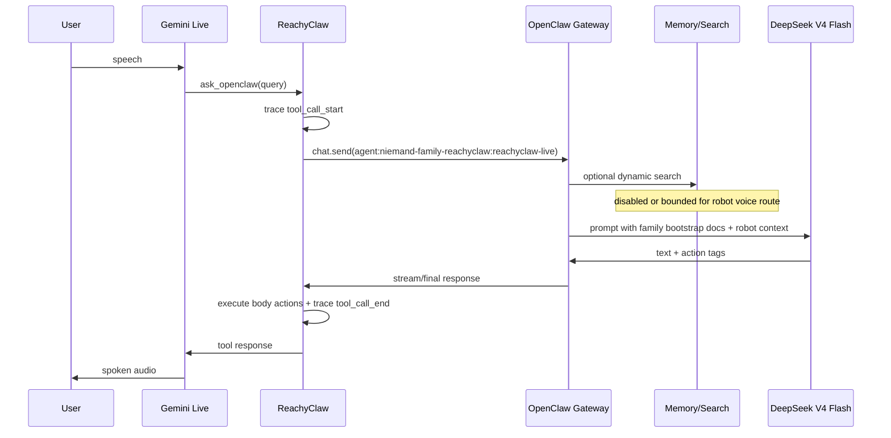

# feat: Improve ReachyClaw latency while preserving family identity

## Summary

This plan improves ReachyClaw voice-turn latency without turning the robot into a contextless agent. The approach is to add direct ReachyClaw timing traces, correlate OpenClaw gateway spans by run id, keep the robot on the `niemand-family` workspace bootstrap files, and disable only the dynamic memory/search paths that are too slow for live speech.

---

## Problem Frame

The live Gemini path now works, but observed voice turns can take tens of seconds because OpenClaw attempts QMD/session memory work during the tool call. The robot should still know who Martin is and inherit the family agent's core identity from the family workspace docs, but it should not block a live voice turn on slow memory search.

---

## Requirements

- R1. Measure where live voice latency is created across Gemini Live, ReachyClaw, OpenClaw gateway, memory search, model generation, body-action execution, and tool response return.
- R2. Keep the ReachyClaw route on a dedicated `niemand-family-reachyclaw` agent using DeepSeek V4 Flash for voice turns.
- R3. Preserve the `niemand-family` bootstrap context for identity and personality: `AGENTS.md`, `USER.md`, `SOUL.md`, and `MEMORY.md`.
- R4. Avoid active-memory and QMD/session-memory blocking paths for the robot route unless explicitly re-enabled after benchmarking.
- R5. Keep normal `niemand-family` traffic unchanged.
- R6. Provide a repeatable smoke-test and log-review workflow proving that live Gemini tool calls complete quickly and still answer identity questions correctly.

---

## Scope Boundaries

- This plan does not change Gemini Live provider selection or voice choice.
- This plan does not remove memory from the normal `niemand-family` agent.
- This plan does not solve global QMD health or embedding backlog issues.
- This plan does not open an upstream PR by itself.
- This plan does not store secrets, tokens, or API keys in repo files.

### Deferred to Follow-Up Work

- Upstream OpenClaw PR for per-channel low-latency memory policy: defer until local config and tracing prove the right shape.
- ReachyClaw UI controls for latency mode: defer until the runtime behavior is stable.

---

## Context & Research

### Relevant Code and Patterns

- `src/reachy_mini_openclaw/gemini_live.py` owns Gemini Live tool-call handling and currently logs the tool call before waiting on OpenClaw.
- `src/reachy_mini_openclaw/openai_realtime.py` owns `_handle_openclaw_query`, prepends Reachy robot body context, executes action tags, and returns clean text to the voice provider.
- `src/reachy_mini_openclaw/openclaw_bridge.py` owns `chat.send`, run-id tracking, event collection, timeout behavior, and the session key used for the OpenClaw route.
- `tests/test_gemini_live_handler.py` already covers Gemini tool-call routing and assistant transcript behavior.
- `tests/test_config.py` already covers provider configuration and is the right place for any new latency/tracing config flags.

### Institutional Learnings

- The live smoke test showed Gemini Live can call `ask_openclaw`, OpenClaw can respond, and ReachyClaw can execute returned body actions.
- The same live test showed QMD memory search can time out before OpenClaw falls back, adding latency even though the active-memory plugin is not configured for the robot agent.
- A fresh OpenClaw bridge smoke test without the wedged session returned in about 5-6 seconds, which is a reasonable target for the live path before additional optimization.

### External References

- No external research is needed for this plan. The relevant behavior is local ReachyClaw code plus observed OpenClaw gateway configuration and logs.

---

## Key Technical Decisions

- Instrument before optimizing: latency improvements should be guided by ReachyClaw timestamps plus OpenClaw run-id-correlated gateway logs, not by guessing from uncorrelated tails.
- Preserve identity through bootstrap docs, not dynamic search: the robot agent should read the family workspace bootstrap files directly instead of querying QMD to rediscover Martin's identity during a voice turn.
- Keep a dedicated robot agent: `niemand-family-reachyclaw` lets the robot have different memory/search and model settings without changing normal family chat behavior.
- Disable dynamic memory for live voice first: QMD/session memory and active-memory are useful for long-form text agents but are too risky inside a realtime tool-call budget.
- Keep skills empty for the robot agent unless a voice workflow needs one: startup and prompt assembly should stay lean for live speech.

---

## Open Questions

### Resolved During Planning

- Should the robot use the exact `niemand-family` agent? No. A dedicated agent is safer because it preserves normal family behavior while allowing low-latency voice settings.
- Should identity come from QMD memory? No. Identity must come from the family workspace bootstrap files so the robot knows Martin even when dynamic memory is disabled.

### Deferred to Implementation

- Whether OpenClaw already injects all four bootstrap files for the dedicated agent: verify by tracing a targeted identity prompt and, if needed, add a narrow system prompt override or bootstrap config.
- Whether QMD should be fully disabled or reduced to `memory` without `sessions`: determine from measured latency after tracing.
- Whether Gemini Live has a provider-side function-call timeout that needs a stricter local budget: determine from timing logs after the first tracing pass.

---

## High-Level Technical Design

> *This illustrates the intended approach and is directional guidance for review, not implementation specification. The implementing agent should treat it as context, not code to reproduce.*

---

## Implementation Units

- U1. **Add ReachyClaw latency tracing**

**Goal:** Make each live voice turn explain where time was spent, with direct timings for ReachyClaw spans and correlation ids for OpenClaw gateway spans.

**Requirements:** R1, R6

**Dependencies:** None

**Files:**
- Modify: `src/reachy_mini_openclaw/config.py`
- Modify: `src/reachy_mini_openclaw/gemini_live.py`
- Modify: `src/reachy_mini_openclaw/openai_realtime.py`
- Modify: `src/reachy_mini_openclaw/openclaw_bridge.py`
- Test: `tests/test_config.py`
- Test: `tests/test_gemini_live_handler.py`
- Create: `tests/test_openclaw_bridge.py`

**Approach:**
- Add an opt-in trace flag so normal logs stay readable.
- Attach a stable trace id to each OpenClaw tool call and carry it through bridge logs, run-id collection, body-action execution, and tool-response return.
- Log elapsed timings for Gemini tool wait, `chat.send` acknowledgement, first assistant event, final response, body-action execution, and Gemini tool-response send.
- Log the OpenClaw `idempotencyKey`, run id, agent id, and session key so gateway memory/model spans can be correlated without adding OpenClaw code first.
- Keep logs secret-safe: no tokens, no raw full prompts, and only bounded query/response excerpts.

**Patterns to follow:**
- Existing structured logging style in `gemini_live.py` and `openclaw_bridge.py`.
- Existing config validation style in `config.py`.

**Test scenarios:**
- Happy path: tracing enabled for a dummy Gemini tool call logs the trace id and routes the OpenClaw response unchanged.
- Happy path: bridge chat receives a mocked run id and final response, and trace timing fields are emitted without altering returned content.
- Happy path: bridge chat logs enough correlation fields to match the same request in OpenClaw gateway logs.
- Edge case: tracing disabled keeps behavior unchanged and does not require a trace id.
- Error path: OpenClaw timeout logs the trace id and returns the existing `"Response timeout"` error.
- Error path: tool execution failure logs a bounded error and still returns a Gemini function response.

**Verification:**
- A live log tail can identify one voice turn end-to-end and assign elapsed time to ReachyClaw spans, then match the same run in gateway logs for memory/model spans.

---

- U2. **Make the robot agent bootstrap from family identity files**

**Goal:** Ensure the dedicated robot agent knows Martin and inherits the family voice/personality without relying on dynamic memory search.

**Requirements:** R2, R3, R5

**Dependencies:** U1 for verification visibility

**Files:**
- Modify: `README.md`
- Modify: `.env.example`
- Test: `tests/test_config.py`

**Approach:**
- Keep `OPENCLAW_AGENT_ID` pointed at the dedicated `niemand-family-reachyclaw` route.
- Document the required OpenClaw-side agent shape: same family workspace as `niemand-family`, DeepSeek V4 Flash primary model, empty skills, and bootstrap files available in that workspace.
- Add a smoke-test expectation for identity prompts such as "do you know who I am?" so success is not just "the request returned".
- If OpenClaw does not inject all required bootstrap files for this dedicated agent, prefer a narrow OpenClaw runtime config change over copying family identity text into ReachyClaw.

**Patterns to follow:**
- Existing README configuration notes for provider and OpenClaw gateway setup.
- Existing `.env.example` comments for session key and agent id.

**Test scenarios:**
- Happy path: config accepts `OPENCLAW_AGENT_ID=niemand-family-reachyclaw` and `OPENCLAW_SESSION_KEY=reachyclaw-live`.
- Documentation verification: setup docs describe the dedicated agent without embedding secrets or personal details.
- Integration scenario: manual smoke test asks "do you know who I am?" and the answer identifies Martin from bootstrap context without waiting on QMD.

**Verification:**
- The robot route can answer identity questions from family bootstrap context while normal `niemand-family` remains untouched.

---

- U3. **Bypass slow dynamic memory for the robot route**

**Goal:** Remove QMD/session-memory latency from live voice turns while preserving static family identity.

**Requirements:** R3, R4, R5, R6

**Dependencies:** U1, U2

**Files:**
- Modify: `README.md`
- Test: `tests/test_config.py`
- Operational target: deployed OpenClaw robot agent entry

**Approach:**
- Configure the deployed OpenClaw robot agent with a per-agent memory-search override rather than changing global memory settings.
- Prefer disabling `memorySearch` for `niemand-family-reachyclaw` if bootstrap docs are sufficient for identity and family personality.
- If implementation proves full disablement removes required bootstrap context, fall back to a bounded memory policy that excludes session search, disables on-search sync, and keeps query limits small.
- Keep `plugins.entries.active-memory.config.agents` unchanged so `niemand-family-reachyclaw` stays outside the active-memory plugin.

**Patterns to follow:**
- OpenClaw agent entries already support per-agent `memorySearch` overrides.
- Existing dedicated-agent pattern created for `niemand-family-reachyclaw`.

**Test scenarios:**
- Manual config verification: robot agent is not present in the active-memory agents list.
- Manual config verification: robot agent has a per-agent memory-search override and does not inherit the default `["memory", "sessions"]` search policy.
- Integration scenario: live voice turn logs no QMD timeout before model generation.
- Regression scenario: normal `niemand-family` still has its original skills, model, and memory behavior.

**Verification:**
- A live identity prompt completes quickly and does not emit QMD timeout lines for the robot agent.

---

- U4. **Correlate OpenClaw gateway spans**

**Goal:** Make OpenClaw-side latency visible without requiring a speculative upstream patch first.

**Requirements:** R1, R4, R6

**Dependencies:** U1, U3

**Files:**
- Create: `docs/reachyclaw-latency-smoke.md`
- Create: `scripts/reachyclaw-smoke-openclaw.py`

**Approach:**
- Document how to match ReachyClaw trace ids, OpenClaw run ids, and gateway log entries for one live voice turn.
- Include explicit checks for QMD memory search, active-memory plugin logs, model generation start/end, `chat.send` acknowledgement, and final response.
- Add smoke-script output fields that can be pasted next to gateway log excerpts without exposing secrets.
- Treat missing gateway span visibility as an implementation discovery point for a later OpenClaw patch, not as a reason to block ReachyClaw tracing.

**Patterns to follow:**
- Existing direct smoke approach used during setup.
- Existing OpenClaw gateway log patterns for `chat.send`, QMD memory warnings, and active-memory plugin entries.

**Test scenarios:**
- Happy path: smoke output includes agent id, session key, elapsed time, and bounded content.
- Error path: smoke output preserves the bridge error and still prints correlation fields available before failure.
- Integration scenario: one live voice turn can be matched across robot logs and gateway logs using the documented fields.

**Verification:**
- A diagnosis run can say whether latency was spent in Gemini, ReachyClaw bridge wait, OpenClaw memory/search, model generation, or post-response body execution.

---

- U5. **Tune tool-call timeout behavior for realtime speech**

**Goal:** Make slow OpenClaw calls fail predictably instead of wedging Gemini Live or causing long silent waits.

**Requirements:** R1, R4, R6

**Dependencies:** U1, U4

**Files:**
- Modify: `src/reachy_mini_openclaw/config.py`
- Modify: `src/reachy_mini_openclaw/openai_realtime.py`
- Modify: `src/reachy_mini_openclaw/gemini_live.py`
- Modify: `src/reachy_mini_openclaw/openclaw_bridge.py`
- Test: `tests/test_config.py`
- Test: `tests/test_gemini_live_handler.py`
- Test: `tests/test_openclaw_bridge.py`

**Approach:**
- Add a voice-specific OpenClaw timeout budget separate from the bridge's generic timeout.
- Ensure Gemini receives a tool response for timeout/error cases instead of leaving the tool call unresolved.
- Keep the timeout response short and safe, while preserving logs that show the exact failure point.
- Avoid retry loops inside the voice path; retries can exceed the realtime interaction budget.

**Patterns to follow:**
- Existing bridge timeout handling and Gemini function-response construction.

**Test scenarios:**
- Happy path: OpenClaw response inside the voice budget returns clean text to Gemini.
- Error path: bridge timeout returns a bounded error response to Gemini and logs the trace id.
- Error path: OpenClaw not connected returns the existing `"OpenClaw not connected"` error without retrying.
- Edge case: partial streamed text before timeout returns the partial content only if existing bridge behavior allows it.

**Verification:**
- A forced slow OpenClaw response does not leave Gemini waiting indefinitely and does not crash the app.

---

- U6. **Document and automate the live smoke test**

**Goal:** Make it repeatable to prove the full Gemini Live/OpenClaw/DeepSeek/body-action chain is working and fast enough.

**Requirements:** R1, R2, R3, R4, R6

**Dependencies:** U1, U2, U3, U4, U5

**Files:**
- Modify: `README.md`
- Modify: `docs/reachyclaw-latency-smoke.md`
- Modify: `scripts/reachyclaw-smoke-openclaw.py`

**Approach:**
- Add a robot-side smoke script that calls the same `OpenClawBridge.chat` path used by live voice and prints agent id, session key, elapsed time, error, bounded content, and correlation fields.
- Add a live smoke checklist for microphone testing: confirm Gemini tool call, OpenClaw response, body action execution, assistant transcript, and absence of QMD/active-memory timeout logs.
- Include expected latency bands so future changes can distinguish "working but too slow" from "working well enough for voice".

**Patterns to follow:**
- Existing README usage and configuration sections.
- Existing direct smoke approach used during setup.

**Test scenarios:**
- Happy path: smoke script returns an OpenClaw response and reports elapsed time.
- Error path: missing gateway connection reports a clear failure and exits nonzero.
- Error path: wrong agent/session config is visible in script output without exposing secrets.
- Integration scenario: live voice checklist confirms the same response path from microphone through spoken audio.

**Verification:**
- A new operator can run the smoke workflow and determine whether latency is coming from Gemini, ReachyClaw, OpenClaw, memory, or model generation.

---

## System-Wide Impact

- **Interaction graph:** The plan touches the realtime voice relay, OpenClaw WebSocket bridge, deployed OpenClaw agent config, and family workspace bootstrap context.
- **Error propagation:** OpenClaw timeout and memory failures should become traceable voice-tool errors rather than silent waits.
- **State lifecycle risks:** Reusing a wedged session key can preserve bad run state; smoke tests should use fresh session keys when diagnosing latency.
- **API surface parity:** OpenAI Realtime and Gemini Live should continue to use the same `ask_openclaw` semantics where possible.
- **Integration coverage:** Unit tests can cover trace plumbing and timeout handling, but live robot verification is required for Gemini tool-call timing and body actions.
- **Unchanged invariants:** Normal `niemand-family` model, skills, active-memory, and QMD behavior must not change.

---

## Risks & Dependencies

| Risk | Mitigation |
|------|------------|
| Disabling memory search removes identity context | Verify bootstrap doc injection first; only disable dynamic memory after identity smoke passes |
| Latency comes from DeepSeek generation rather than memory | U1 traces separate memory/search from model generation before optimizing |
| Gemini Live drops or interrupts long tool calls | U5 adds a voice-specific timeout and ensures every tool call receives a response |
| Runtime OpenClaw config is not versioned in this repo | Document the required deployed agent shape and keep repo changes limited to ReachyClaw docs/scripts/tests |
| Personal identity docs contain sensitive data | Do not copy personal content into ReachyClaw; reference bootstrap inheritance only |

---

## Documentation / Operational Notes

- Update setup docs to recommend `niemand-family-reachyclaw` for robot voice sessions.
- Keep the robot session key stable only after latency is healthy; use fresh session keys for diagnosis.
- Log excerpts used for troubleshooting should redact tokens and long identifiers.
- If a future upstream PR is opened, split it from local robot configuration changes and request explicit approval first.

---

## Sources & References

- Related code: `src/reachy_mini_openclaw/gemini_live.py`
- Related code: `src/reachy_mini_openclaw/openai_realtime.py`
- Related code: `src/reachy_mini_openclaw/openclaw_bridge.py`
- Related code: `src/reachy_mini_openclaw/config.py`
- Related tests: `tests/test_gemini_live_handler.py`
- Related tests: `tests/test_config.py`
- Related docs: `README.md`
- Planned docs: `docs/reachyclaw-latency-smoke.md`
